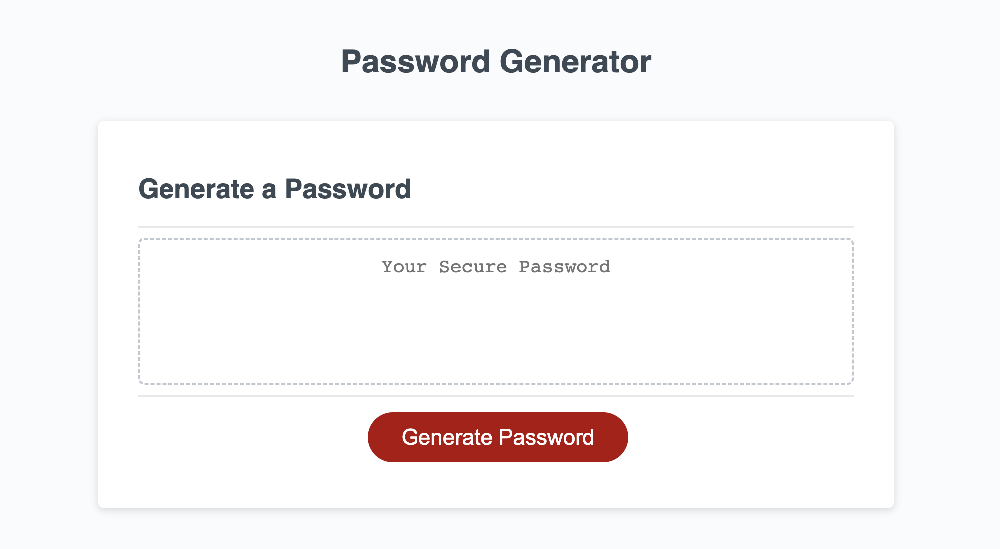

# Nick Burr's Password generator (Challenge 03)
## [Deployed App](https://itsmenickfromschool.github.io/Nicholas_Burr_Challenge_03/)

## Description
My motivation for making this app was to learn some basic javascript skills. I built this simple app to show how you can use javascript features to generate random strings. During the process I learned more about variables, arrays, functions, objects, and methods. It solves the problem of coming up with secure passwords. It is rather useful, lots of people tend to just use birthdays, pet names, or something similar. This is not secure. A random sequence of characters is much harder to figure out. 

## Installation
N/A

## Usage

In order to use this app you click the red generate button and follow the prompts that will come up in the pop-up window. Make sure to follow the instructions with detail!

## Credits

For this Challenge I worked on my own. I referenced some javascript from [w3schools](https://www.w3schools.com/) I also referenced special characters from [OWASP](https://owasp.org/www-community/password-special-characters). The Javascript code is my own in addition to the starter code, which was provided by EDX2U for the fullstack web development coding bootcamp.

## License

Refer to the Repo for the license.

